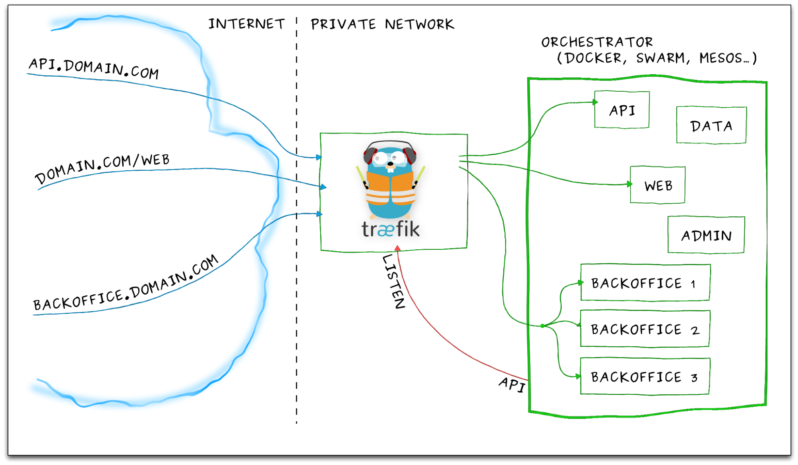

# Træfɪk with Docker Swarming

This example use a local DinD Swarming Cluster to show
how you can use docker swarming for your microservices.

We use [træfɪk](https://traefik.io/) for simplify your dynamic service publishing and http reverse proxy.

We add a lot of more example and fix some scripts for better handling.

## Loadbalancing with Træfɪk at a docker swarming fleet

Proudly present first at : Docker Meetup Bochum 1.12.2016 : Træfɪk and more Træfɪk

* https://www.meetup.com/de-DE/Docker-Bochum/events/235649414/

We explain the Træfɪk basics

but also some useful tips to use Træfɪk with docker swarming mode

Test your setup with DinD...

Start this presentation with
  * `docker run -d -ti -p 4212:80 infrabricks/traefik-with-docker`
  * `open http://<dockerhost>:4212/traefik-with-docker`

Regards
Peter Rossbach (peter.rossbach@bee42.com) @PRossbach
Niclas Mietz (niclas.mietz@bee42.com) @solidnerd

## Links

* https://codefresh.io/blog/deploy-docker-compose-v3-swarm-mode-cluster/
* https://traefik.io/
