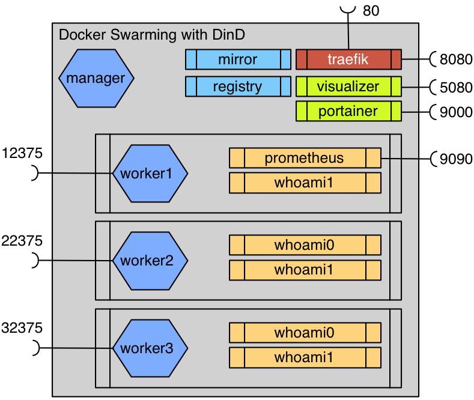

# Træfɪk with Docker Swarming

## Big Party

### Loadbalancing with Træfɪk at a docker swarming fleet

Docker Meetup Bochum 1.12.2016 : Træfɪk and more Træfɪk

* https://www.meetup.com/de-DE/Docker-Bochum/events/235649414/

We explain the Træfɪk basics

but also some useful tips to use Træfɪk with docker swarming mode

Test your setup with Dind...

Start this presentation with
  * `docker run -d -ti -p 4212:80 infrabricks/traefik-with-docker`
  * `open http://<dockerhost>:4212/traefik-with-docker`

Regards
Peter Rossbach (peter.rossbach@bee42.com) @PRossbach

## Links

* https://codefresh.io/blog/deploy-docker-compose-v3-swarm-mode-cluster/
* https://traefik.io/
