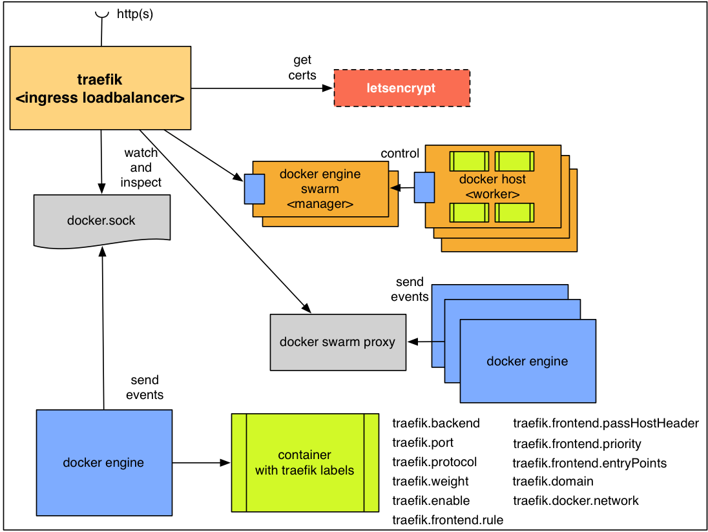

# bee42 docker meetup talk
## Træfɪk with Docker


### **Peter Rossbach**
### **Niclas Mietz**

---
## The crew bee42 invite you
## rethink IT with POTts

The Purpose, Organisation, Technology transition service


* Peter Rossbach - bee42 solutions gmbh
  * <peter.rossbach@bee42.com> @PRossbach
* Nicals Mietz - bee42 solutions gmbh
  * <nicals.mietz@bee42.com> @solidnerd

---
## Reverse Proxy: Træfɪk


***
* https://traefik.io
* @traefikproxy
* @emilevauge

-
### Important Træfɪk facts

* Project founder is Emile Vauge (23.8.2015)
* Status at 29.11.2016
  * 5419 Stars
  * 309 issues closed
  * 78 Contributors
  * x Maintainer

***
* https://github.com/containous/traefik

-
### Features I

* It's fast
* No dependency hell, single binary made with go
* Rest API
* Multiple backends supported: Docker, Swarm, Kubernetes, Marathon, Mesos,
  * Consul, Etcd, and more to come
* Watchers for backends, can listen for changes in backends to apply a new configuration automatically
* Hot-reloading of configuration. No need to restart the process
* Graceful shutdown http connections
* Circuit breakers on backends
* Round Robin, rebalancer load-balancers

-
### Features II

* Rest Metrics
* Tiny official docker image included
* SSL backends support
* SSL frontend support (with SNI)
* Clean AngularJS Web UI
* Websocket support
* HTTP/2 support
* Retry request if network error
* Let's Encrypt support (Automatic HTTPS with renewal)
* High Availability with cluster mode

---
## Use an easy loadbalancer like Træfɪk



***
* https://traefik.io/

-
### Have fun with Træfɪk community


-
### ByExample:
#### Simple Træfɪk on your docker localhost

```
$ cat >docker-compose.yml <<EOF
traefik:
  image: traefik
  command: --web --docker --docker.domain=docker.localhost --logLevel=DEBUG
  ports:
    - "80:80"
    - "8080:8080"
  volumes:
    - /var/run/docker.sock:/var/run/docker.sock
    - /dev/null:/traefik.toml
whoami:
  image: emilevauge/whoami
  labels:
    - "traefik.backend=whoami"
    - "traefik.frontend.rule=Host:whoami.docker.localhost"
EOF
$ docker-compose up -d
$ curl -L -H Host:whoami.docker.localhost http://localhost
$ docker-compose scale whoami=3
$ curl -L -H Host:whoami.docker.localhost http://localhost
$ curl -L -H Host:whoami.docker.localhost http://localhost
$ docker-compose down
```

---
## Træfɪk with docker swarming mode


-
### Docker-in-Docker with swarming mode at Docker For Mac


-
### Start your local DinD docker swarm

```
$ docker swarm init
$ SWARM_TOKEN=$(docker swarm join-token -q worker)
$ SWARM_MASTER=$(docker info | grep -w 'Node Address' | awk '{print $3}')
$ NUM_WORKERS=3
$ for i in $(seq "${NUM_WORKERS}"); do \
    docker run -d --privileged --name worker-${i} \
    --hostname=worker-${i} -p ${i}2375:2375 docker:1.13.0-r2-dind \
      docker --host=localhost:${i}2375 \
      swarm join --token ${SWARM_TOKEN} ${SWARM_MASTER}:2377 \
done
$ docker run -it -d -p 8000:8000 \
    -e HOST=localhost -e PORT=8000 \
    -v /var/run/docker.sock:/var/run/docker.sock \
    manomarks/visualizer
```

***
* http://blog.terranillius.com/post/swarm_dind/
* https://github.com/ManoMarks/docker-swarm-visualizer
* https://medium.com/@alexeiled/docker-swarm-cluster-with-docker-in-docker-on-macos-bdbb97d6bb07#.yry5s0jiv

-
### Træfɪk labels I

* `traefik.backend=foo`
  assign the container to foo backend
* `traefik.backend.maxconn.amount=10`
  set a maximum number of connections to the backend. Must be used in conjunction with the below label to take effect.
* `traefik.backend.maxconn.extractorfunc=client.ip`
  set the function to be used against the request to determine what to limit maximum connections to the backend by. Must be used in conjunction with the above label to take effect.
* `traefik.backend.loadbalancer.method=drr`
  override the default wrr load balancer algorithm
* `traefik.backend.loadbalancer.sticky=true`
  enable backend sticky sessions
* `traefik.backend.circuitbreaker.expression=NetworkErrorRatio() > 0.5`
  create a circuit breaker to be used against the backend
* `traefik.port=80`
  register this port. Useful when the container exposes multiples ports.
* `traefik.protocol=https`
  override the default http protocol

-
### træfɪk labels II

* `traefik.weight=10`
  assign this weight to the container
* `traefik.enable=false`
  disable this container in Træfɪk
* `traefik.frontend.rule=Host:test.traefik.io`
  override the default frontend rule (Default: `Host:{containerName}.{domain}`).
* `traefik.frontend.passHostHeader=true`
  forward client Host header to the backend.
* `traefik.frontend.priority=10`
  override default frontend priority
* `traefik.frontend.entryPoints=http,https`
  assign this frontend to entry points `http` and `https`. Overrides `defaultEntryPoints`.
* `traefik.docker.network`
  Set the docker network to use for connections to this container

-
### Start Træfɪk at docker swarming mode

```
$ docker network create --driver=overlay traefik-net"
$ docker service create \
  --name traefik \
  --constraint=node.role==manager \
  --publish 80:80 \
  --publish 8080:8080 \
  --mount type=bind,source=/var/run/docker.sock,target=/var/run/docker.sock \
  --network traefik-net \
  traefik:v1.1.0 \
  --docker \
  --docker.swarmmode \
  --docker.domain=traefik \
  --docker.watch \
  --web"
```

***
* https://github.com/containous/traefik/blob/master/docs/user-guide/swarm-mode.md

-
#### Start a registry as service

```
$ docker service create --name registry --publish 5000:5000 registry:2
$ curl localhost:5000/v2/_catalog
```

push your service image

```
$ DOCKER_REGISTRY=localhost:5000
$ docker tag emilevauge/whoami $DOCKER_REGISTRY/emilevauge/whoami
$ docker push $DOCKER_REGISTRY/emilevauge/whoami
```

-
#### Deploy a new swarm services

Create whoami services

```
$ docker service create \
    --name whoami0 \
    --label traefik.port=80 \
    --network traefik-net \
    $DOCKER_REGISTRY/emilevauge/whoami
$ docker service create \
    --name whoami1 \
    --label traefik.port=80 \
    --network traefik-net \
    $DOCKER_REGISTRY/emilevauge/whoami
```

Access the services

```
$ docker service update --replicas 2  whoami0
$ docker service scale whoami0=4 whoami1=3
$ curl -H Host:whoami0.traefik http://localhost
$ curl -H Host:whoami1.traefik http://localhost
```

-
### Træfɪk Dashboard


-
### Build your own service

* start registry at your swarm
  * localhost trick!
* push your build to registry
* start service from your local registry

---
## Letsencrypt support

* Public TLS certs
* Automatic certs rotation
* Traefik use [Lego](https://github.com/xenolf/lego): The best Let's Encrypt library in go

***
* https://letsencrypt.org/
* https://github.com/xenolf/lego
* https://docs.traefik.io/user-guide/examples/#lets-encrypt-support

-
### Letsencrypt flow


-
### Better TSL support

* Check your certs A+
  * https://www.ssllabs.com/ssltest/
* Talk from WJAX 2016
  * https://github.com/tboeghk/terrific-tls-tuning-tips

---
## Summary

* Træfɪk is a reverse proxy with easy setup and config
* HTTP/1.1, HTTP/2 and websocket support
* Auto config with multiple service discoveries
  * Kubernetes
  * Docker + Docker swarming
  * Consul
  * ETCD
  * ...
* Designed in mind for dynamic infrastructure and microservices
* Cool simple Dashboard
* Metric support
* Easy and free TLS Support is now possible!

---
## Build your systems for friends


---
## Many Thanks for following!

* Start this presentation with
  * `docker run -d -ti -p 4212:80 infrabricks/traefik-with-docker`
  * `open http://<dockerhost>:4212/traefik-with-docker`

***
Peter Rossbach

follow the blog [www.infrabricks.de](http://www.infrabricks.de)

@PRossbach

More Training: http://www.bee42.com/training/

-
### Docker Camp


* 1.12 Docker Meetup Bochum - Træfɪk
* 5.12 DevOpsCon Docker Basic Workshop (Munich)
* 8.12 DevOpsCOn Docker Expert OpenSpace Workshop (Munich)
* 12-14.12 Docker Camp at Berlin
* 21.12 Docker Meetup Dortmund

***
* http://devops-training.de/

-
### bee42 solutions gmbh - Devops Bochum
### rethink IT at the POTT


We offer TOP-IT jobs...

***
* http://bee42.github.io
* http://www.bee42.com

-
#### DevOps Engineer

* Living an Agile culture
* Influence us to DevOps-Journey
* Enable people to use modern technologies
* Build applications that living at the clouds
* Design services with clever API's
* Think infrastructure first

***
* send your offering to peter.rossbach@bee42.com

-
#### Website Engineer

* Create beautiful human responsive services
* Find new ways to create creative web service
* Find good solutions with HTML/CSS/Javascript to create simple services
* Think mobile first

***
* send your offering to peter.rossbach@bee42.com

-
### Setlog GmbH - Supply Chain Management


We offer jobs...

* Administrator
  * Experiences with
    * Maintain a cluster of linux machines
    * Setup Docker infrastructure
    * Config management with ansible
    * Release java applications
  * Linux and mysql skills
* Developer
  * Experiences with
    * Create java based *micro*services
    * Spring Boot and Netflix Stack
    * Docker knowledge

***
* send your offering to p.rossbach@setlog.com

-
### German Docker Book


***
* http://www.dpunkt.de/docker

-
### Give the navigator the rudder!


---
## Appendix

This slides shows shell commands executed in different places. The line prefix shows where to run them:

```
$ ... – local machine
> ... – remote machine
# ... – docker container
```

---
## Links

* http://www.infrabricks.de
* http://www.bee42.com
* https://www.docker.com
* https://github.com/docker/docker
* https://github.com/docker/machine
* https://github.com/docker/swarmkit
